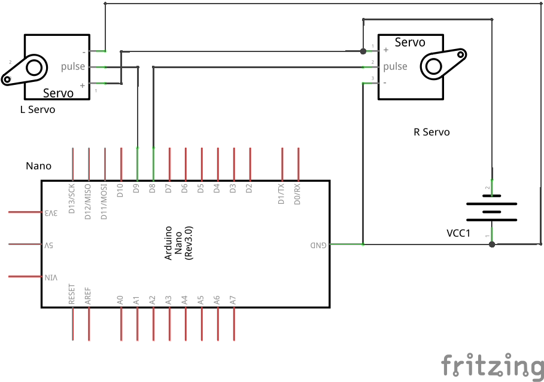
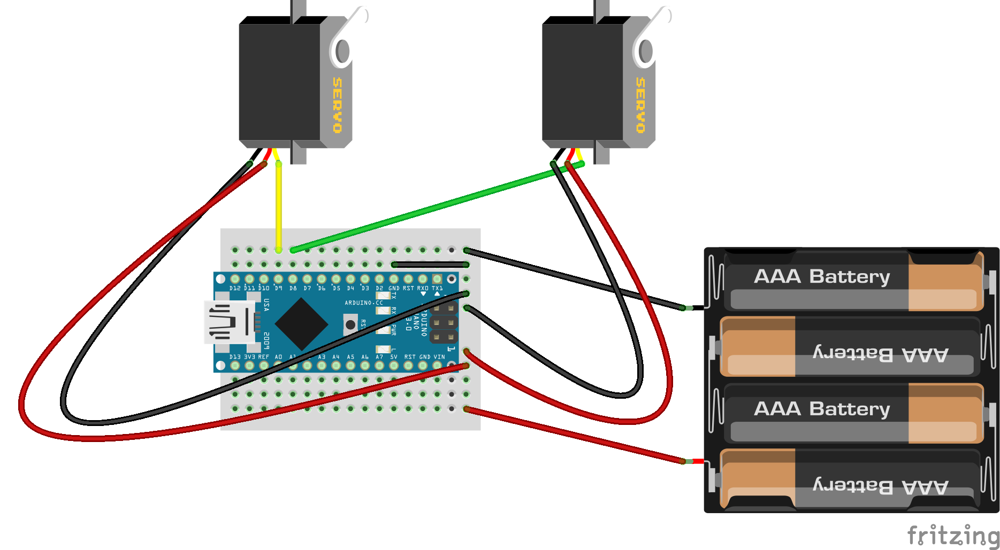
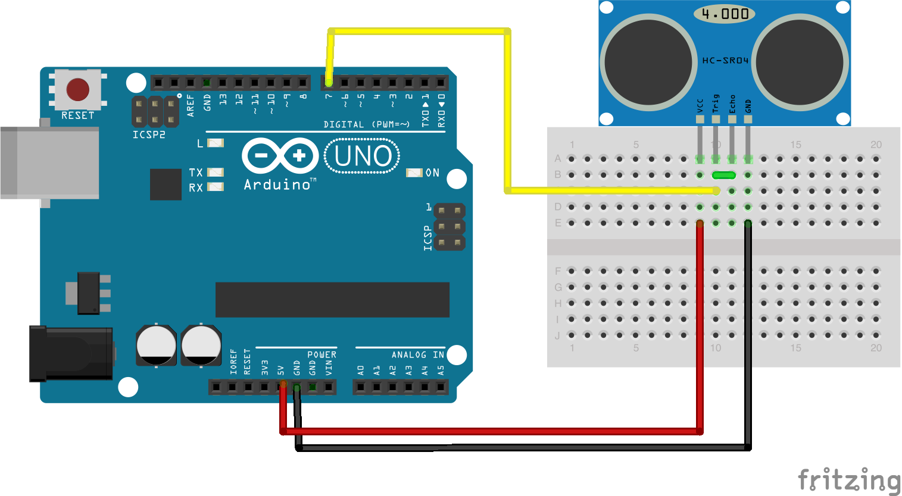

## Materials needed

- Arduino Nano
- Ultra Sonic Sensor
- Battery Holder
- CR 360 Servos 
- Mini BreadBoard
- M-M, M-F and F-F jumper cables
- Cable Ties 
- AA Batteries
- USB Cable for Arduino Bit Long 
- Wheels that fixes the CR Servos
- LED

## Rules
- Not taller than 30cm and not longer than 20cm

More info on [SimpleBot](https://github.com/nodebotsau/simplebot/)

## Installing Firmata 
- Download and install Arduino IDE.
- Goto Example -> Firmata -> Standard Firmata.
- Compile and upload the code

###Errors
- Most of the errors are related to usb not plugged properly, try rebooting the computer.

### Wiring up the SimpleBot (Servo)
The wiring diagrams are provided here:

Schematic:

Breadboard:

####Ulrasonic Sensor

Breadboard

- (http://blog.nortal.com/cloud-controlled-work-desks-using-arduinos-node-js-polymer/)
